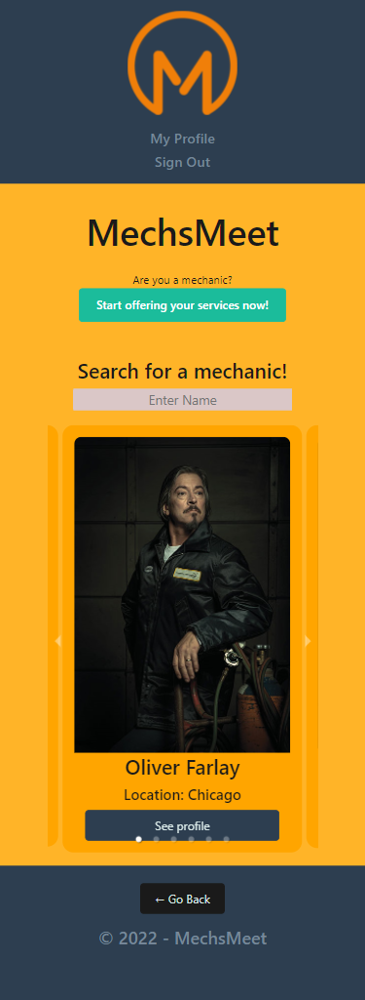
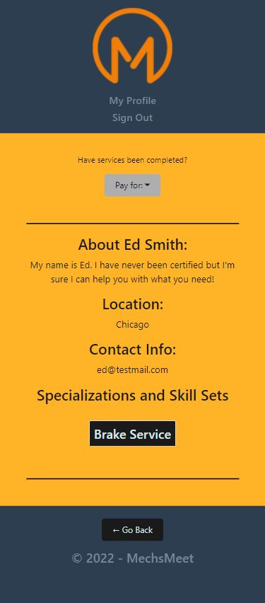
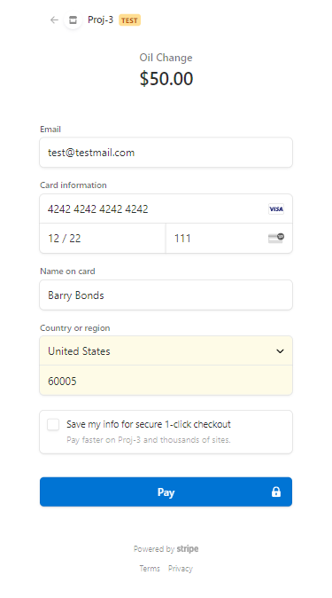

[](https://opensource.org/licenses/MIT)
  
# Mechanic Looker Upper

## Link to deployed Heroku app:

https://project-3-nu.herokuapp.com/

## Link to public repo on Github:

https://github.com/nlaramee120/project_3

## Table of Contents
1. [Description](#Description)
2. [Final Product Image](#Final-Product-Image)
3. [User Story](#User-Story)
4. [Installation and Instructions](#Installation-and-Instructions)
5. [License](#License)
6. [Questions](#Questions)

## Description

***AS SOMEONE who needs to have their car repaired, but don't know who to go to for help<br>
I WANT to be able to have an app where I can locate mechanics near me and find one that may have the specialization or skillset to help with my issue<br>
SO THAT I CAN save time and effort finding information or recommendations from multiple sources for where I should go***

When it comes to car issues, there are two types of car owners in this world:

1) People who refuse to go to a dealership for repair because they refuse to pay an arm and a leg
2) People whose car is out of warranty

This app answers the notorious question, "***Do you know someone who knows a mechanic who might know what's wrong with my car and can help?***"

This app is designed as a networking and servicing app to connect local mechanics and people in need of their services -- similar to Tinder or Skillshare.

## Final Product Image

- Images of final product/app<br>




- Video walkthrough of UI/UX for a guest<br>
<a target="_blank" href="https://watch.screencastify.com/v/LLGl1sEt9pS6r8nOr0lx">Click Here</a>
- Video walkthrough of UI/UX for a mechanic<br>
<a target="_blank" href="https://watch.screencastify.com/v/vikKLe5DY3NRf5CgpD0S">Click Here</a>

## User Story
```
GIVEN a functional app and simple user face

WHEN I first load the app
THEN I am presented with a landing page explaining the use case for the app and can be redirected via buttons based on my intentions

***Mechanic UI/UX***
WHEN I click "Start offering your services!"
THEN I am presented with a sign-up page to create a profile as a mechanic, in which I am automatically redirected to my profile page where I can view/edit my personal information.

***Guest UI/UX***
WHEN I click on "Start looking for mechanics!"
THEN I am presented with a carousel to browse through that will list mechanics who have created accounts to offer their services
    or
THEN I am presented with an input field where I can enter a specific name of a mechanic for which I can "jump" to their profile directly

WHEN I click "See profile" on a mechanic's preview within the carousel
THEN I am presented with more detailed information about the mechanic

WHEN I need to pay a mechanic for services rendered
THEN I click on "Pay <mechanic name>" within a profile to be redirected to an inegrated, trusted, payment site where I can enter my card information and pay as needed (I will be notified of a successfull payment and directed back to the homepage when a payment is completed)
```

## Installation and Instructions
- No installation is required as this is a fully deployed public app. Simply visit this <a href="https://project-3-nu.herokuapp.com/">link</a> and start using the app!

## License
- MIT License
- Copyright 2021

    Permission is hereby granted, free of charge, to any person obtaining a copy of this software and associated documentation files (the "Software"), to deal in the Software without restriction, including without limitation the rights to use, copy, modify, merge, publish, distribute, sublicense, and/or sell copies of the Software, and to permit persons to whom the Software is furnished to do so, subject to the following conditions:
    
    The above copyright notice and this permission notice shall be included in all copies or substantial portions of the Software.
    
    THE SOFTWARE IS PROVIDED "AS IS", WITHOUT WARRANTY OF ANY KIND, EXPRESS OR IMPLIED, INCLUDING BUT NOT LIMITED TO THE WARRANTIES OF MERCHANTABILITY, FITNESS FOR A PARTICULAR PURPOSE AND NONINFRINGEMENT. IN NO EVENT SHALL THE AUTHORS OR COPYRIGHT HOLDERS BE LIABLE FOR ANY CLAIM, DAMAGES OR OTHER LIABILITY, WHETHER IN AN ACTION OF CONTRACT, TORT OR OTHERWISE, ARISING FROM, OUT OF OR IN CONNECTION WITH THE SOFTWARE OR THE USE OR OTHER DEALINGS IN THE SOFTWARE.

## Collaborators
- James Capadocia<br>
-> GitHub Profile: <a href="https://github.com/jcapadocia3">jcapadocia3</a><br>
-> Email: james.capadocia@gmail.com<br><br>
- Nick Laramee<br>
-> GitHub Profile: <a href="https://github.com/nlaramee120">nlaramee120</a><br>
-> Email: nlaramee120@aol.com<br><br>
- Edgar Ortega<br>
-> GitHub Profile: <a href="https://github.com/EdgarO93">EdgarO93</a><br>
-> Email: edort93@gmail.com<br><br>
***Please feel free to contact any collaborator for more information***
